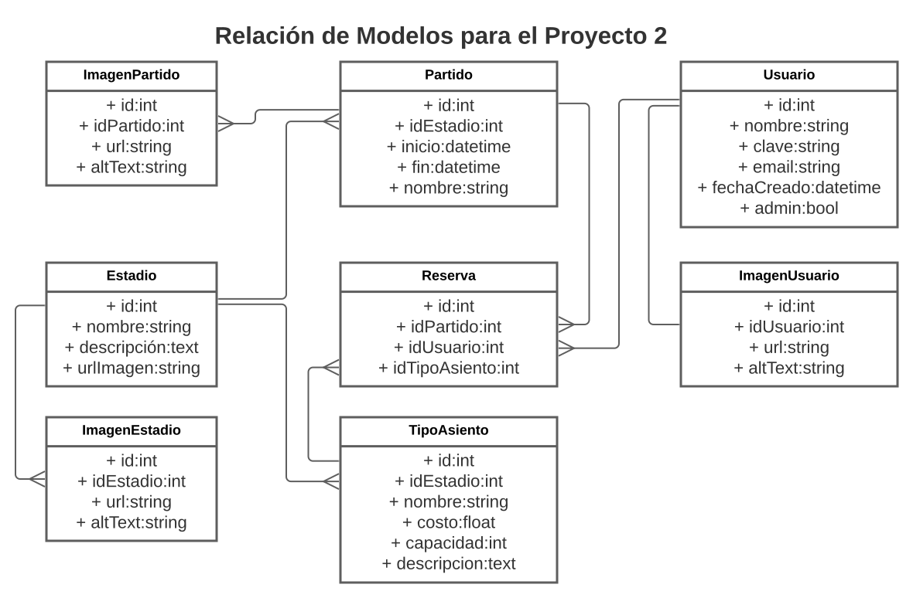

# Web_Program
First attemp to introduce ourselves to web development

## Diagrama de Modelos del Proyecto



## Ejecución Local
```
python3 manage.py runserver 0.0.0.0:8000
```

## Docker
### Creación de la Imagen con Docker
Para crear una imagen con todo lo requerido para ejecutar el proyecto, correr:
```
docker build . --file Dockerfile --tag proyecto2
```

### Creación de un Contenedor a Partir de la Imagen Creada
Para iniciar el contenedor a partir de la imagen creada y acceder a la terminal,
correr:
```
docker run -p 8000:8000 -ti proyecto2 /bin/bash
```
Para iniciar el servidor, correr:
```
# Iniciar el servidor
python3 /home/proyecto2/manage.py runserver 0.0.0.0:8000
```

### Otros Comandos Útiles de Docker
```
docker image ls -a     # Mostrar todas las imagenes
docker ps -a           # Mostrar todos los contenedores
docker system prune -f # Limpiar imagenes y contenedores
```

### Otros Comandos Útiles
```
lsof -i -P -n # Revisar procesos en puertos
```
